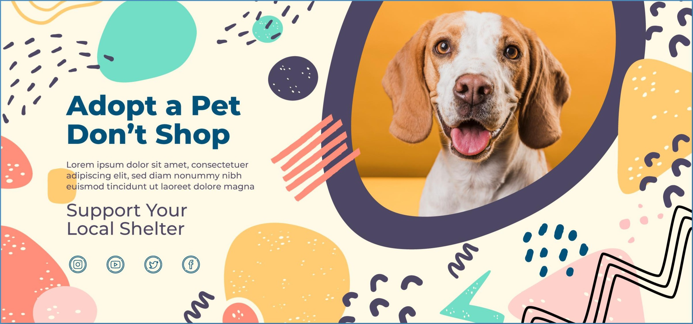
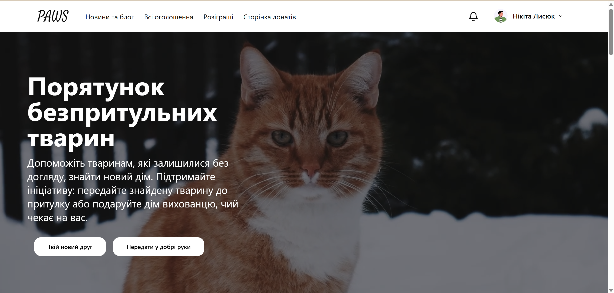
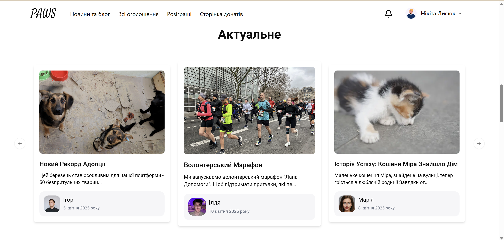
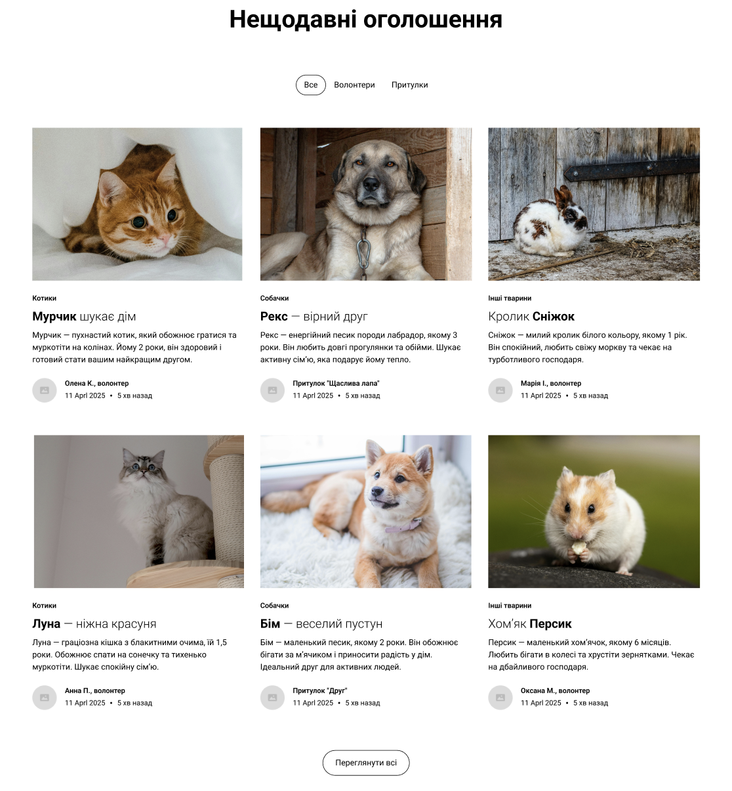
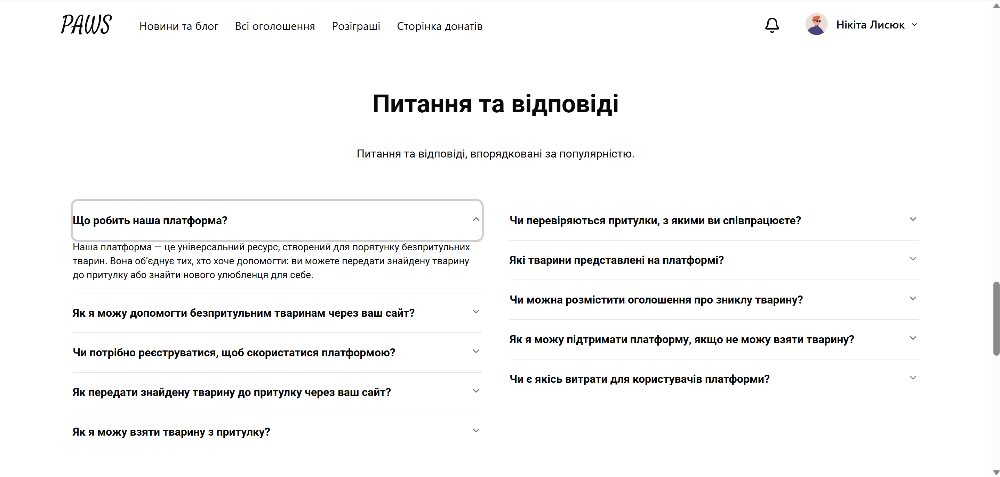
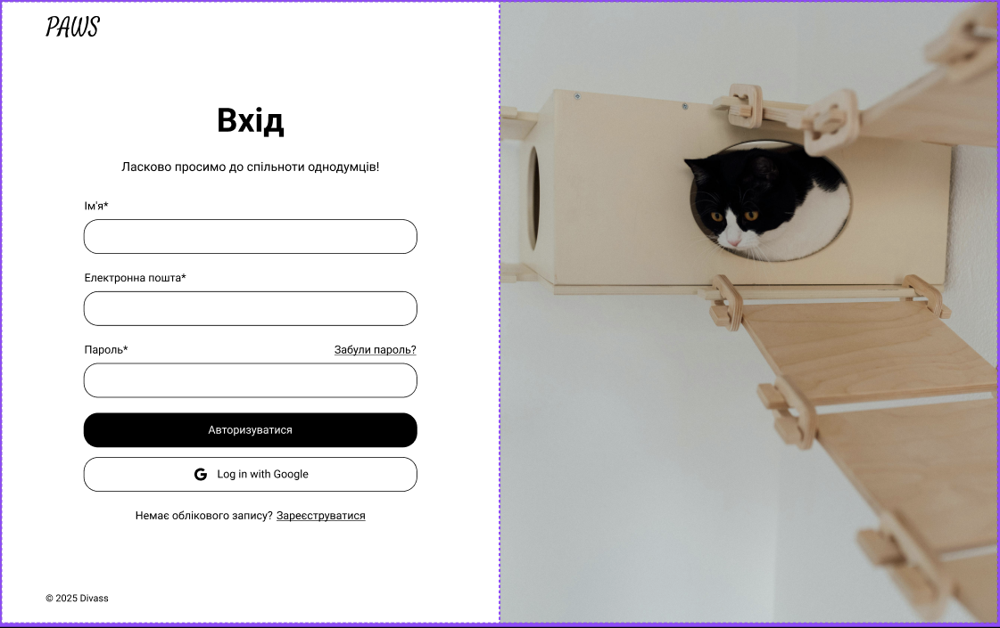
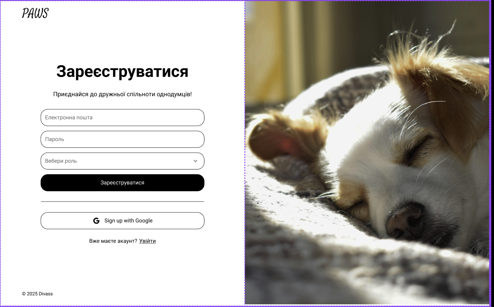
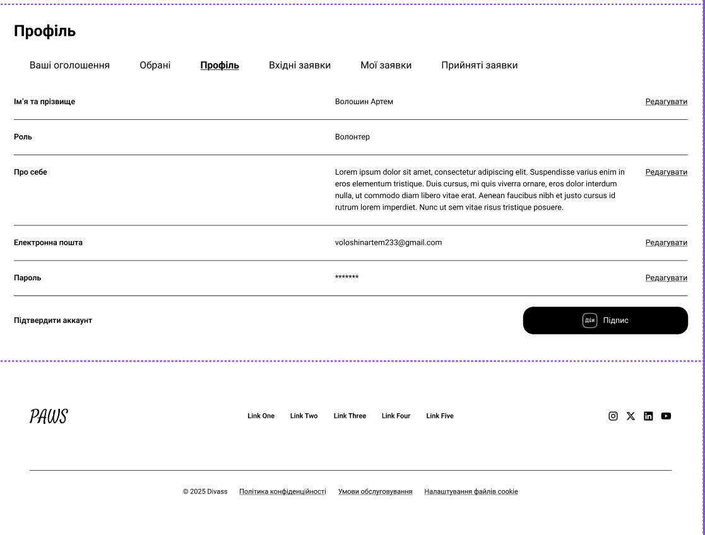
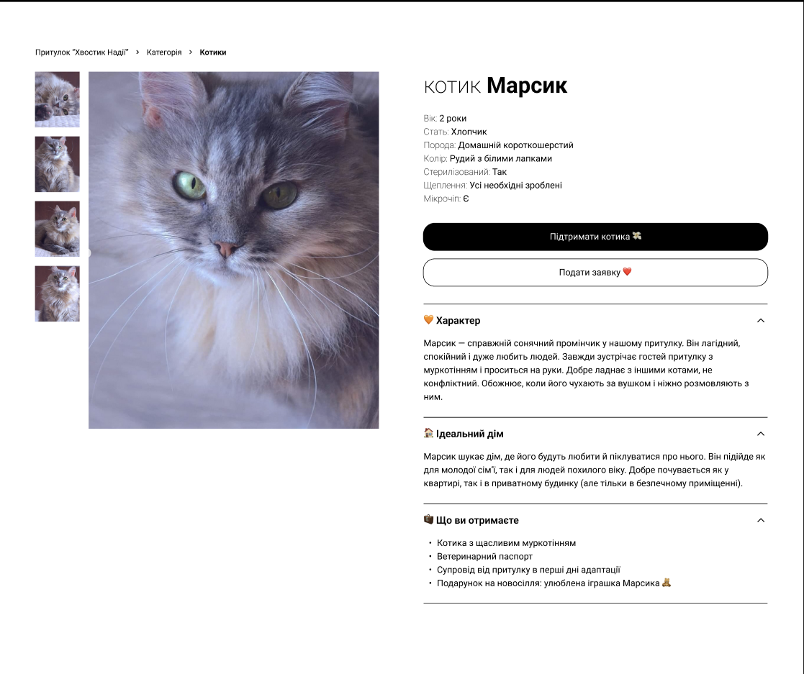

<!-- README.md -->

<head>
  <link rel="preconnect" href="https://fonts.googleapis.com">
  <link rel="preconnect" href="https://fonts.gstatic.com" crossorigin>
  <link href="https://fonts.googleapis.com/css2?family=Satisfy&display=swap" rel="stylesheet">
</head>

<br />
<p align="center">
  
</p>

<h1 align="center" class="title">PETS</h1>
<p align="center" class="subtitle">"Друзі, які завжди поруч"</p>

---

<p align="center">
  <a href="https://vitejs.dev/">
    
  </a>
  <a href="https://reactjs.org/">
    
  </a>
  <a href="https://www.typescriptlang.org/">
    
  </a>
  <a href="https://tailwindcss.com/">
    
  </a>
  <a href="https://shadcn.dev/">
    
  </a>
</p>

---

## Зміст

- [Опис проєкту](#опис-проєкту)
- [Технології](#технології)
- [Функціонал](#функціонал)
- [Скріншоти](#скріншоти)
- [Запуск проєкту](#запуск-проєкту)
- [Автори](#автори)

---

## Опис проєкту

**PETS** — це соціальна платформа, мета якої — об'єднати волонтерів, притулки та небайдужих людей, щоб допомогти постраждалим тваринам під час війни. Це не лише сервіс оголошень, а ціла екосистема взаємодії, підтримки та турботи.

---

## Технології

- **React** + **Vite**
- **TypeScript**
- **TailwindCSS**
- **Shadcn UI**
- **React Router DOM**
- **Zod** (валідація)
- **React Hot Toast** (нотифікації)
- **json-server** (локальна БД для розробки)

---

## Функціонал

### 🔐 Аутентифікація

- Реєстрація/авторизація через Email/Password та Google
- Відновлення паролю
- Збереження токена в localStorage

### 👤 Профіль користувача

- Редагування профілю (без ролі)
- Зміна пароля
- Завантаження аватарки

### 🧑‍🤝‍🧑 Ролі

- **Волонтер** — створює оголошення, допомагає тваринам, зв'язується з притулками
- **Притулок** — приймає заявки на усиновлення, створює оголошення про тварин

### 📢 Оголошення

- CRUD функціонал: створення, редагування, видалення, перегляд
- Фільтрація за категоріями: Всі / Волонтер / Притулок
- Пошук по назві тварини, притулку або волонтеру
- Додавання в обране

### 🐶 Сторінка тварини

- Інформація про тварину
- Відгуки і коментарі

### 🏠 Сторінка притулку

- Інформація про притулок
- Відгуки, коментарі
- Заявка на усиновлення

### 📰 Блог та новини

- Читання статей і новин
- Створення, редагування, видалення власних матеріалів

### 📄 Сторінка "Про нас"

- Інформація про команду, проєкт, партнерів

---

## Скріншоти

<p align="center">
  
  
  
  
  
  
  
  
</p>

---

## Запуск проєкту

> Необхідно мати встановлений `pnpm` та `Node.js`

### 1. Встановити pnpm:

```bash
npm install -g pnpm
```

### 2. Клонувати репозиторій:

```bash
git clone https://github.com/Vatsonio/Haca2025.git
```

### 3. Перейти в директорію проєкту:

```bash
cd Haca2025
```

### 4. Встановити залежності:

```bash
pnpm install
```

### 5. Запустити сервер бази даних (json-server):

```bash
pnpm add -D json-server
pnpm run server
```

### 6. Запустити застосунок:

```bash
pnpm run dev
```

---

## Автори

> Команда, яка дійсно любить тварин і хоче змінити світ. Якщо ви хочете долучитися або маєте ідеї — пишіть!
